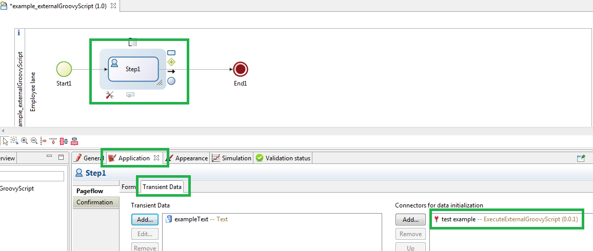

# connector-externalGroovyScript
Description : Update an external groovy script without recompiling the process

Author : Frederic KREBS

Bonita BPM version : 6.3.3

##Objectives : Execute an external groovy script
You can edit the script without recompiling neither redeploying the process on the server
* Use as a form widget connector, it allows you to edit the script and refresh the screen to see the result
* Use as a Form transiant data connector, it allows you to edit the script and refresh the screen to see the result
* Use as an activity connector, it allows you to edit the script, restart a new process instance and see the changes

##Connector Input Parameters : 
	filePath : the full file path to the script
	inputMap : a java.util.Map variable to pass data to the script
##Connector Output : 
	result : Java Object

##Installation and usage:
* copie the script file in your hardrive
* In the process, change the connector file path : the connector in the process example is in the Form transiant data. See FAQ
* Execute the process
* Go to step 1 form
* Change the script and save the script
* Refresh your navigator

##FAQ :
* Why Form Transiant Data Connector :
Because Form Transiant Data Connector are replayed each time the form is reloaded, 
compare to Activity connectors which are played only once.

